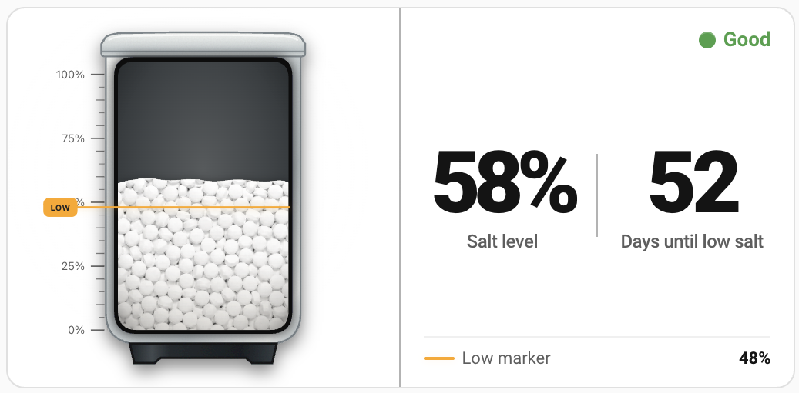

# SaltWatch

**See your water-softener salt level in Home Assistant and know when it is time
to refill.**

[](https://github.com/thomasgregg/saltwatch/actions/workflows/esphome.yml)

**[Install SaltWatch in your browser](https://thomasgregg.github.io/saltwatch/)**

SaltWatch is a local, purpose-built monitor for a water-softener brine tank. An
M5Stack distance sensor mounted under the lid measures the salt surface and
turns that distance into a calibrated level from 0–100%.

Once connected through ESPHome, Home Assistant shows the current distance,
estimated salt level, low-salt warning, calibration state, and sensor health.
These appear as native entities that can be placed on a dashboard or used in
your own automations and notifications.
SaltWatch explicitly marks failed or outdated measurements as unavailable, so
an old reading cannot quietly look current after a blocked or disconnected
sensor.

<p align="center">
  <a href="https://github.com/thomasgregg/saltwatch-card">
    
  </a>
</p>

**Recommended Home Assistant card:**
[SaltWatch Card](https://github.com/thomasgregg/saltwatch-card) is the preferred
dashboard card for SaltWatch. It brings the current level, refill forecast,
low-salt threshold, and device status together in one clear view. The card is
available through HACS and includes a graphical editor for straightforward
dashboard setup.

## Contents

- [Why SaltWatch](#why-saltwatch)
- [Hardware](#hardware)
- [Quick start](#quick-start)
- [Calibration](#calibration)
- [Home Assistant entities](#home-assistant-entities)
- [Testing without hardware](#testing-without-hardware)
- [Forecast](#forecast)
- [Notifications](#notifications)
- [Trustworthy failure behavior](#trustworthy-failure-behavior)
- [Local web interface and updates](#local-web-interface-and-updates)
- [Documentation](#documentation)
- [Supported hardware and firmware](#supported-hardware-and-firmware)
- [License](#license)

## Why SaltWatch

A softener can keep running after the salt is nearly gone, and a failed sensor
can look deceptively normal if its last reading remains visible. SaltWatch is
designed around those two problems:

- see the current lid-to-salt distance and estimated salt percentage;
- get a stable low-salt warning with hysteresis;
- calibrate full and empty levels from Home Assistant;
- distinguish low salt from invalid calibration and sensor failure;
- remove stale measurements automatically when valid readings stop; and
- continue measuring when Home Assistant is offline.

The firmware also learns the tank's rate of decline and estimates when it will
reach the low-salt threshold. The estimate runs on the device, survives normal
restarts, and never overrides measurement or fault safety.

## Hardware

- M5Stack ATOM Lite **C008**
- M5Stack ToF Unit **U010** with VL53L0X
- Included Grove cable
- USB data cable: USB-C for the ATOM Lite, with USB-C or USB-A to match the
  computer
- 5 V USB power supply
- 3M Dual Lock SJ3550 and a rubber cable grommet for mounting

The ToF Unit mounts inside the lid and points down at the salt. The ATOM Lite
stays outside the tank. See the [hardware and acceptance guide](docs/hardware.md)
before permanent installation.

## Quick start

1. Open the **[SaltWatch web installer](https://thomasgregg.github.io/saltwatch/)**
   in desktop Chrome or Microsoft Edge.
2. Connect the ATOM Lite directly to the computer with a USB data cable. The
   C008 normally enters programming mode automatically.
3. Select **Connect and install SaltWatch**, choose the serial port, and approve
   the installation.
4. Enter the 2.4 GHz Wi-Fi credentials when prompted.
5. Open the local interface at the address shown by the installer. No login is
   required.
6. Open ESPHome Device Builder in Home Assistant and select **Adopt** for the
   discovered SaltWatch device. Adoption generates the encrypted native API
   configuration automatically.
7. Add the discovered ESPHome integration under **Settings → Devices &
   services**.
8. Install the sensor in the lid and complete both calibration steps below.

No command line, local ESPHome installation, OTA password, or web-server
password is required for this route. For alternative installation and update
methods, see the [installation guide](docs/installation.md).

## Calibration

Salt Level remains unavailable until both calibration points are completed.
This prevents placeholder values from appearing as a believable percentage.

### Set the full point

1. Fill the tank to its normal desired full level and close the lid normally.
2. Wait two to three minutes for **Distance to Salt** to settle.
3. Press **Set Current Distance as Full** in Home Assistant or the local web UI.

### Set the empty point

1. At the lowest useful salt level, close the lid normally.
2. Wait for **Distance to Salt** to settle.
3. Press **Set Current Distance as Empty**.
4. Confirm **Calibration Required** turns off and **Salt Level** becomes
   available.

Empty means the lowest useful and reliably measurable level, not necessarily
the physical bottom of the tank. Both distances can also be entered manually.
See the [calibration and operation guide](docs/calibration.md) for validation
rules, manual calibration, and low-salt behavior.

## Home Assistant entities

| Entity | Purpose |
| --- | --- |
| **Distance to Salt** | Median-filtered distance from the lid to the salt surface in centimetres. |
| **Salt Level** | Calibrated and clamped estimate from 0–100%. |
| **Estimated Days Until Low Salt** | Device-native estimate of when the warning threshold will be reached; unavailable until the trend is trustworthy. |
| **Forecast Status** | Explains whether the estimate is learning, available, confirming a refill, or blocked. |
| **Forecast Details** | Gives a short reason or learning-progress message when the estimate is not yet available. |
| **Last Recorded Refill** | Timestamp of the most recent automatically confirmed or manually recorded refill; unavailable until the first refill is recorded. |
| **Salt Status** | `Initializing`, `Sensor Fault`, `Calibration Required`, `Low Salt`, or `Good`. |
| **Low Salt** | Problem indicator that includes five percentage points of hysteresis. |
| **Sensor Fault** | Reports missing, timed-out, invalid, or out-of-range measurements. |
| **Calibration Required** | Reports incomplete, reversed, out-of-range, or insufficient calibration. |
| **Calibration Details** | Explains exactly why calibration is incomplete or invalid. |
| **Full Distance** | Persistent full-level calibration value. |
| **Empty Distance** | Persistent empty-level calibration value. |
| **Low Salt Threshold** | Persistent warning threshold; default 20%. |
| **Set Current Distance as Full** | Captures the current filtered distance as full. |
| **Set Current Distance as Empty** | Captures the current filtered distance as empty. |
| **Record Salt Refill** | Starts a new forecast cycle after a small or unusual refill that was not detected automatically. |
| **WiFi Signal** | Standard ESPHome diagnostic signal strength. |
| **Last Valid Measurement Age** | Diagnostic age of the most recent accepted sensor reading; disabled by default. |
| **Forecast Confidence** | Optional evidence-quality diagnostic; disabled by default. |

Entity names and identifiers are kept stable so firmware updates do not create
duplicates in Home Assistant.

Every SaltWatch node automatically appends the final three bytes of its MAC
address to its technical ESPHome name, for example `saltwatch-a1b2c3`. This
keeps discovery, hostnames, and Home Assistant device relationships unique when
more than one SaltWatch is installed. The Home Assistant device can still be
renamed to a friendly location such as **SaltWatch Utility Room**.

## Testing without hardware

`saltwatch-emulator.yaml` creates a complete virtual SaltWatch device on a
macOS or Linux computer. It uses ESPHome's host platform, so the SaltWatch Card
sees the same device relationship, ESPHome entity metadata, and stable original
entity names as it would with the physical monitor.

From a local checkout with ESPHome installed, run:

```sh
esphome run saltwatch-emulator.yaml
```

In Home Assistant, open **Settings → Devices & services → Add integration →
ESPHome**, enter the computer's LAN address, and keep the default API port
`6053`. Host-based ESPHome nodes are not discovered automatically. The local
firewall must allow Home Assistant to reach that port.

The resulting **SaltWatch Emulator** device provides controls for salt level,
salt status, forecast days, forecast status, forecast details, and the low-salt
threshold. Set either simulated numeric value to `-1` to make its corresponding
sensor unavailable and test fault, calibration, initialization, or forecast
learning displays. The emulator remains available only while its process is
running and should be used on a trusted development network.

## Forecast

**Estimated Days Until Low Salt** answers when you are likely to need more salt,
not merely how much is present today. It is built into SaltWatch: no Home
Assistant package, YAML editing, helper entities, or restart is needed.

SaltWatch learns from up to 28 trustworthy daily values, rejects sparse or noisy
data, and confirms refill-like rises before starting a new cycle. A first
estimate normally needs at least seven days and two percentage points of real
decline. After it learns a completed cycle, that past rate lets the estimate
resume immediately after future refills while new evidence accumulates. See
[how forecasting works](docs/forecast.md), including status meanings, refill
handling, confidence, and limitations.

**Last Recorded Refill** remembers when SaltWatch most recently started a new
forecast cycle because a refill was confirmed automatically or the **Record
Salt Refill** button was accepted. It is informational only and never changes
the forecast calculation. A possible refill does not update the timestamp
until its second six-hour value confirms the rise. If Home Assistant time is
temporarily unavailable during a manual refill, the forecast cycle still
starts immediately and the timestamp is completed at the next successful time
synchronization.

## Notifications

The optional Home Assistant blueprint sends confirmed low-salt, fault,
calibration, forecast, and recovery messages to a selected notification target.
It imports through the Home Assistant UI and requires no package or restart.
See [notification setup](docs/notifications.md).

## Trustworthy failure behavior

SaltWatch accepts only finite readings from 5–120 cm and feeds only valid
measurements into its five-sample median. Independent startup and measurement
watchdogs ensure that a disconnected, blocked, or malfunctioning sensor cannot
leave an old distance displayed indefinitely.

When measurement fails, Distance to Salt and Salt Level become unavailable,
Sensor Fault turns on, Low Salt turns off, and Salt Status becomes Sensor Fault.
Valid measurements recover automatically. Calibration persists across normal
restarts and sensor recovery.

The detailed filtering, timeout, status-priority, persistence, and recovery
design is documented in the [technical reference](docs/technical-reference.md).

## Local web interface and updates

After Wi-Fi provisioning, open the MAC-suffixed address shown by ESPHome, such
as `http://saltwatch-a1b2c3.local/`, or use the device IP. The local interface
shows the SaltWatch entities, supports calibration controls, and accepts manual
OTA firmware uploads. ESPHome Device Builder can also install updates
wirelessly.

The web interface and both OTA paths intentionally have no password. Anyone who
can reach the device can change calibration or replace its firmware. Keep
SaltWatch on a trusted, preferably isolated IoT network, never expose it to the
internet, and restrict access with firewall rules when possible. Home Assistant
API communication is encrypted after Device Builder adoption.

## Documentation

- [Installation and updates](docs/installation.md) — browser installation,
  Device Builder adoption, manual builds, and OTA updates
- [Hardware installation and acceptance](docs/hardware.md) — mounting, wiring,
  care, and the complete hardware test checklist
- [Calibration and operation](docs/calibration.md) — full/empty calibration,
  manual values, thresholds, hysteresis, and normal use
- [Salt forecast](docs/forecast.md) — built-in learning, refill handling,
  confidence, statuses, and limitations
- [Home Assistant notifications](docs/notifications.md) — optional one-click
  blueprint setup and testing
- [Technical reference](docs/technical-reference.md) — measurement pipeline,
  failure handling, persistence, status rules, entities, and limitations
- [Development and validation](docs/development.md) — repository structure,
  build commands, CI, release artifacts, and validation results
- [Changelog](CHANGELOG.md)

## Supported hardware and firmware

SaltWatch is built for the M5Stack ATOM Lite C008 using the `m5stack-atom`
board definition, ESP-IDF, GPIO26/GPIO32 I²C, and the VL53L0X at address `0x29`
in long-range mode. Release builds are validated with ESPHome 2026.8.1 and
ESP-IDF 5.5.5.

## License

[MIT](LICENSE)
